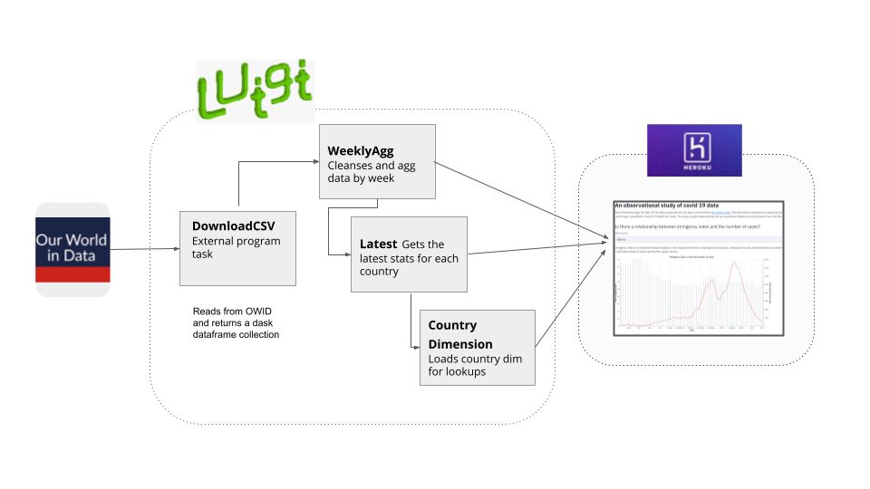

### CS29 COVID Visualizer

This is the final project for CSCI-29. The data presented here has been extracted from Our world in data.
The information presented here examines the relationship between different socio-economic variables and covid impact, 
quantified in terms of % death and cases.

## Sources

The primary data source for this analysis is OWID (Our world in data database).
I initially built scrapers which scrapped additional geographic attributes from the data but due to lack of referential integrity, I excluded them from the analysis.

## Architecture overview

The image provided below highlights the technical architecture used for the project

#### Design highlights:
    * Single responsibility principle and atomicity - via luigi framework
    * Microsciences approach for data extraction
    * Usage of Streamlit and altair as the visualization framework
    * Automatic testing and deployment to Heroku using CI/CD
    
## Limitations
- The study is purely observational and no causational inference should be drawn from the data

    

